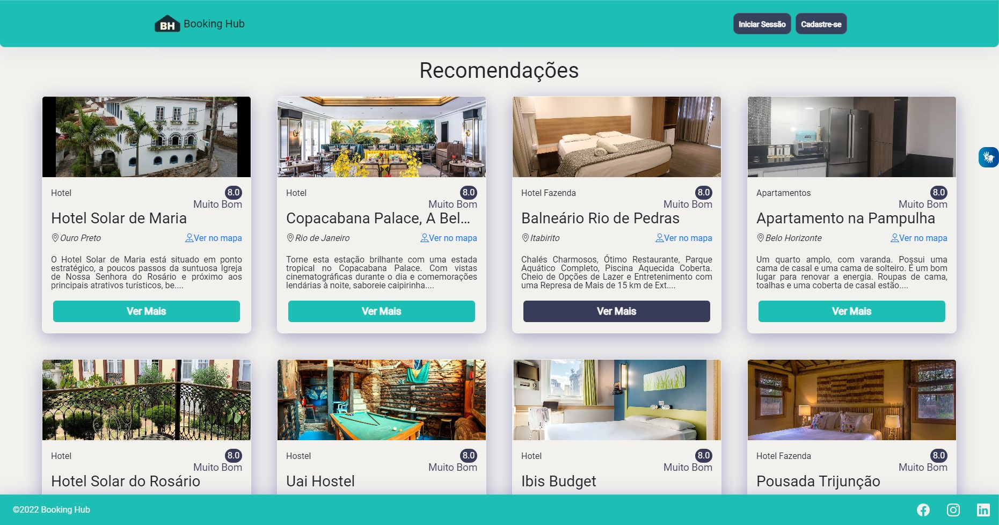
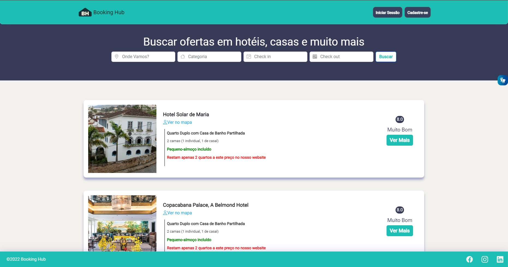
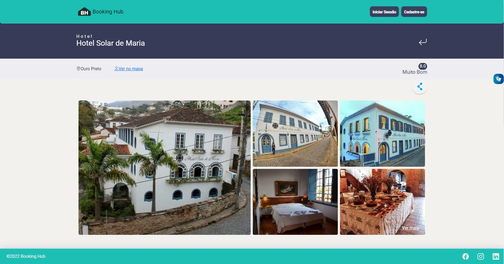
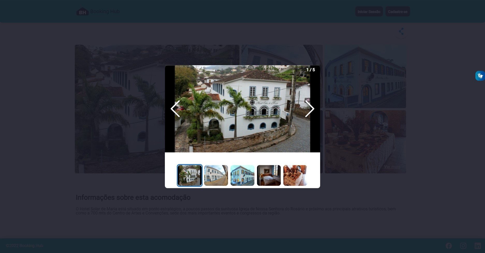
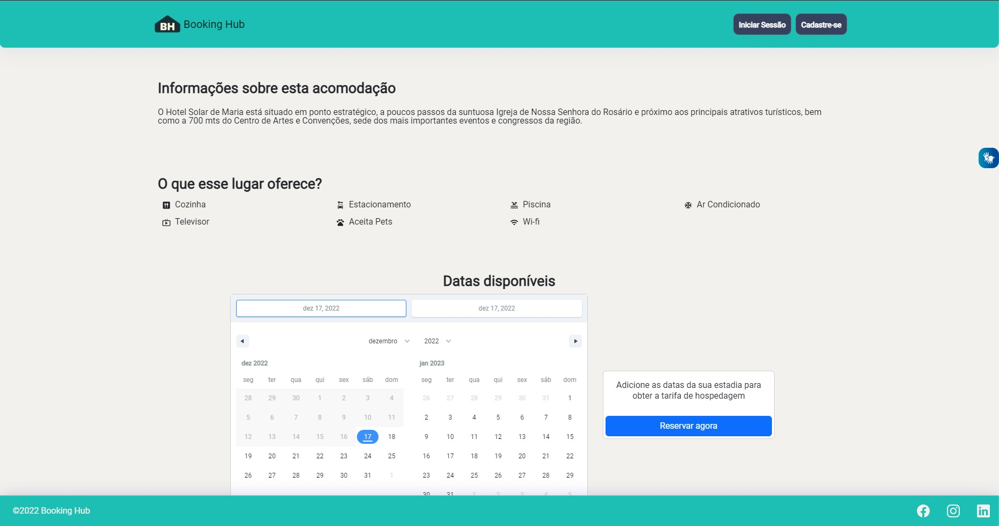
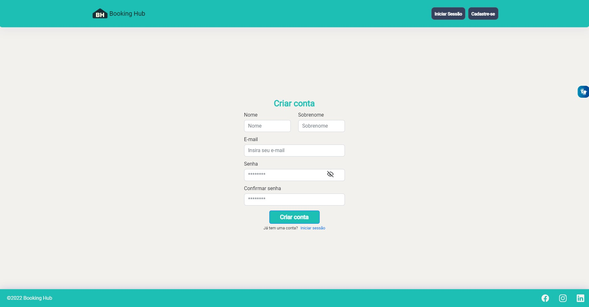

# Bookinghub

## O que é?

https://bookinghub-godoynetworks.netlify.app

O Bookighub é uma aplicação fullstack web e mobile, que atua como uma plataforma de anúncios de locações para estadias temporárias, ou seja, um intermediador entre cliente e proprietário de imóvel, realizado como bootcamp do MercadoLivre em parceria com a Globant, através da Digital House.

O projeto possui um diferencial que busca acessibilidade ao usuário, disponibilizando de ferramenta para leitura/usabilidade em Libras.
O projeto em si possui um modelo de negócio similar ao [Booking](https://www.booking.com).

## Screenshots

## Tecnologias Utilizadas
### Backend
- Java
- Spring Boot
- Hibernate / JPA
- Web Security / JWT
- Maven

### Frontend
- HTML / CSS / JavaScript 
- Vite
- ReactJS
- TailwindCSS
- Stylized Components

### Infraestrutura
- AWS: S3, EC2, RDS (MySQL)
- Ansible
- Terraform
- Docker, Docker Compose

## Implantação em produção
- Backend: Dockerfile em EC2 da AWS.
- Frontend: Dockerfile em EC2 da AWS.
- Banco de dados: AWS RDS.

## Instalação
###  Como funciona?
Clone o repositório 
`git clone https://github.com/FelipeGodoy96/Bookinghub.git`

#### Backend

1)Java Web Server

a) Baixe e instale o editor de texto para Java. No exemplo usaremos [InteliJ](www.jetbrains.com/pt-br/idea/download/#section=windows), mas você pode usar outros como Eclipse ou NetBeans. 

b) Baixe e instale o [JDK 17](https://www.jetbrains.com/help/idea/sdk.html#define-sdk) em seu InteliJ.

c) Baixe o arquivo ZIP deste repositório. Extraia o conteúdo do arquivo em uma pasta no local que desejar.

d) Navegue até a pasta e clique com o botão direito no arquivo pom.xml e selecione a opção "Editar com InteliJ"

e) Por padrão, a branch main está configurada para o deploy na infraestrutura da AWS, então será necessário algumas configurações: 

	I - navegue até a pasta src/main/resources, abra o arquivo `application.properties` e verifique se o `spring.profiles.active` está setado para `dev`. Caso não, mude para dev.
	
	II - abra o arquivo `application-dev.properties`, comente a linha 10 e descomente a linha 11.
	
	III - na linha 12 mude de `admin` para `root` e na linha 13 coloque a senha que criou em seu MySQL Server + Workbench (veremos a seguir).
	

### MySQL 

a) Baixe e instale o [MySQL Installer 8.0.31](http://dev.mysql.com/downloads/installer) na opção "Developer Default".

b) Após a conclusão, abra o MySQL Workbench conecte-se na instância local com seu usuário root e a senha definida durante a instalação.

c) Na aba de `queries`, crie um banco de dados de nome bookinghub_db. Você pode usar o comando `CREATE DATABASE bookinghub_db;`

d) Navegue até a pasta backend, abra o arquivo seeding.txt, copie todo o conteúdo e cole na query do workbench, execute.

Feito essas etapas, volte para o InteliJ e navegue até a pasta src/main/java/br.com.APIrest.APIrest, clique com o botão direito no arquivo APIrestApplication.java e selecione Run ou pressione o atalho Ctrl + Shift + F10. Pronto, a API já está online e comunicando-se com o banco de dados.

### Frontend

a) Baixe e instale o editor de texto para JavaScript. No exemplo usaremos [VSCode](code.visualstudio.com/download).

b) Baixe e instale o [NodeJS](http://nodejs.org/en/). Marque a opção para instalação do Chocolatey.

c) Navegue até a pasta frontend, abra o terminal (Ctrl + ') e execute o comando `npm install --global yarn`, depois `yarn install`.

d) Navegue até a pasta frontend/src/services, abra o arquivo apiHandle.JS e mude os endereços da linha 5 e 7 para localhost:8080

f) Volte para a pasta frontend, abra o terminal e execute `yarn run dev`.

## Suporte

Se você tiver alguma dúvida ou dificuldade técnica com a instalação entre outras ocorrências, você pode entrar em contato através do linkedin dos responsáveis por este projeto.
[Felipe Godoy](www.linkedin.com/in/felipe-godoy-00186812b/)

## Autores
[Felipe Godoy](https://www.linkedin.com/in/felipegodoy-dev)

